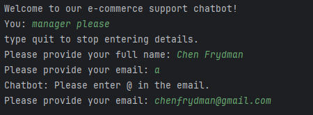
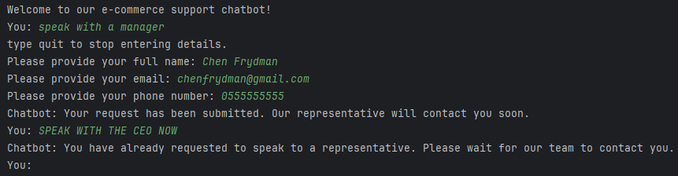
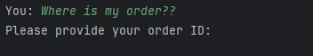
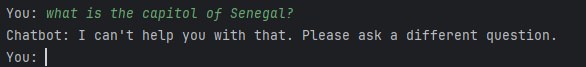
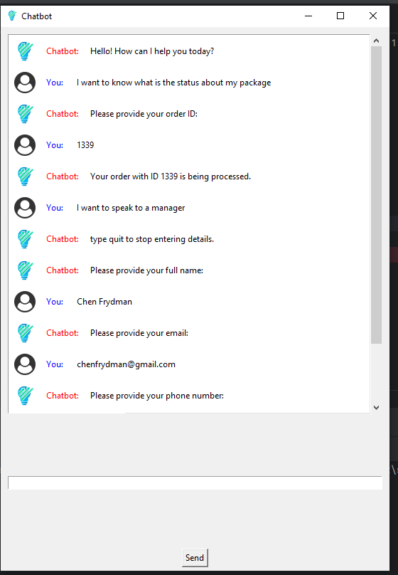

# insait.io-chatbot
A homework assignment for insait.io. creating a chatbot for customer chat.
The homework was done with correct Software Engineering practices, including Dependency Injection and seperating the code to different modules.
Also there is a CLI and GUI version for the chatbot.

## requirements
- dotenv
- OpenAI
- tkinter

## How to run
create new .env file in ./src folder with the following variables:
OPENAI_API_KEY="YOUR_API_KEY"
and run the main.py for CLI or chatbox.py for GUI

## Accuracy
The chatbot trying to select the user's intent by using the OpenAI API. The accuracy of the chatbot is dependent on the accuracy of the OpenAI API.
With the tests I have done in testChatBot.py, I have  97.53% with gpt-3.5 and 98.77% with gpt-4.0 over n=81 tests.

## How does it work
After getting the input from the user, OpenAI API is called to analyze the user's intent. The response is then used to select one of the predetermined intents.
This way, we are prohibiting the chatbot from going off-topic and also reducing the amount of tokens used in the OpenAI API.

### Speak to Representive

#### Input validation
- name: must be a space in the name
- phone: must be either local number with 10 digits or international number with 12 digits and a plus in the start
- email: must have @ and a dot in the email
furthermore validation could have been done but it's a simple example.

After the chat thinks that user wants to speak to a representative, the chatbot will ask for the user's name, phone and email.
The user has the option to not provide the details and exit the speak with the representative.
If he chooses so, the chatbot will remember the users already inserted details if the user decides to speak with the representative again.
If the user have a mistake in one of details, it will tell the user what is the problem and remember the inserted already details.

Example: 

If the user already made a representive request, the chatbot will tell him that he already made a request and please wait.

#### csv
After the user completes the details, the chatbot will save the details in a csv file.

### Order Status
If the user wants to know the status of his order, the chatbot will ask for the order number.
Example: 

### Return Policies:
The chat just tells the user the asked return policy.

### Other
The chatbot will ignore unrelated questions so the chat will not go off-topic.

## Front End
### CLI
The CLI version is a simple command line interface that takes user input and returns the chatbot's response.
Please run main.py for the CLI 

### GUI
The GUI version is a simple tkinter interface that takes user input and returns the chatbot's response.
Please run chatbox.py for the GUI

## Improvements
the chatbot can be improved by
- using BERT for intent classification
- using a local model for intent classification, so we don't have to call the OpenAI API